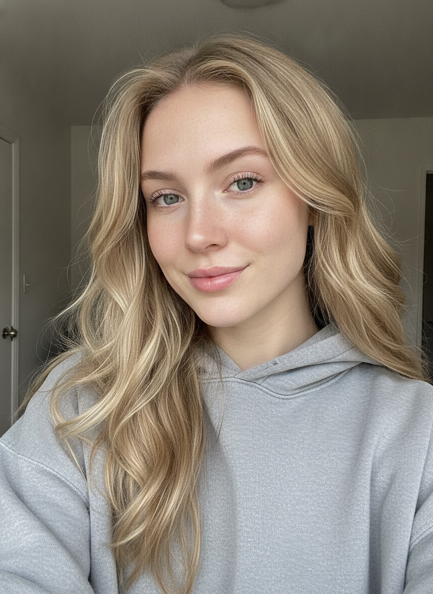

# ZCLIP_

**UGC reaction hooks, typed — not filmed.**

ZCLIP is a chat-driven studio that mass-produces the short vertical
"reaction hook" clips that open TikTok / Reels / Shorts ads — the
talking-head gasp that makes people stop scrolling. Type what should
happen, get a take in ~60 seconds, then *iterate by conversation*:
every take becomes context for the next one, and you can rewind to any
point in the thread and branch from there.

<p>
  
  
  
  
  
  
</p>

*27 built-in cast cards (all AI-generated people) × 10 settings — or bring
your own reference image. Every card's base prompt is visible and editable;
there is no hidden prompt.*

---

## Two ways to run it — the browser is the taste, local is the home

ZCLIP is **local-first**, but since v0.5.0 the hosted deploy is a real,
usable studio too ([design doc](docs/HOSTED.md)):

- **In the browser (hosted)**: bring your own keys — they live in this
  browser's localStorage and **pass through** the server only while a
  request runs (video providers block browser CORS and need authed MP4
  proxying, so a server hop is unavoidable — never stored or logged there;
  the cloud build refuses to fall back to server env keys, so visitors can
  only ever spend their own). No file vault, no GRAB, Act-Two capped by the
  platform's ~4.5MB body limit, reference-video Seedance off.
- **Locally (`bun dev`)**: keys never leave your machine (`.env.local`),
  every take is vaulted to disk, everything unlocks. This is the better
  way to run ZCLIP, and the hosted app says so out loud — see
  [`/install`](app/install/page.tsx).
- Cloud-vs-local is decided in one place, [`lib/deploy.ts`](lib/deploy.ts)
  (`isCloud()` = `process.env.VERCEL === "1"`). Set `ZCLIP_CLOUD=1` to
  preview the hosted behavior locally; `APP_PASSWORD` still gates a deploy
  you want private (see [Deploying](#deploying-to-vercel)).

The public pages (landing + install guide) are bilingual **English / 한국어**;
the studio itself is English-only. Architecture and contributor notes live in
[`docs/ARCHITECTURE.md`](docs/ARCHITECTURE.md).

---

## Quickstart

```bash
git clone https://github.com/DanialDaeHyunNam/zclip
cd zclip
bun install
bun dev          # → http://localhost:3000
```

Open **http://localhost:3000/chat**, click the key chip, and paste a
[Gemini API key](https://aistudio.google.com/apikey) — it's written to
`.env.local` on your machine, never to the browser. That single key powers
both the prompt refiner and the default video model (Veo 3.1 Fast).
Pick a face, pick a room, hit send.

> **Heads-up on cost:** video generation is real money (≈$0.30–0.80 per
> take — see [pricing](#providers--pricing)). The estimate is shown next to
> the send button before every take, and a per-session spend dashboard
> lives in the session header.

### Requirements

| What | Why | Install |
| --- | --- | --- |
| [bun](https://bun.sh) | runtime + package manager | `curl -fsSL https://bun.sh/install \| bash` |
| Gemini API key | prompt refiner + Veo | [aistudio.google.com/apikey](https://aistudio.google.com/apikey) — **Veo needs billing enabled** (no free video tier) |
| `yt-dlp` + `ffmpeg` *(optional)* | the GRAB tool — pull reference videos from YouTube/X, trim clips | `brew install yt-dlp ffmpeg` |

No database. No accounts. All state (sessions, takes, spend ledger) lives
in your browser's localStorage; the server side is a handful of thin
Next.js route handlers that exist only to keep API keys off the client.

---

## Why not just use the provider's own playground?

1. **Takes become context.** Each finished take can seed the next one — a
   mid-video frame is captured and chained automatically (continuity mode),
   or pin any earlier take as explicit context ("take 1's background, take
   3's outfit"). Playgrounds give you one-shot generations; ZCLIP gives you
   a thread you can steer, rewind, and branch like a conversation.
2. **Model swap mid-thread.** Veo, Sora, and Grok Imagine behind one
   adapter interface — flip the model on a failed take and hit retry.
   Adding a provider is [one file](#adding-a-provider).
3. **Performance transfer — two ways.** Attach a reference video *and* a
   cast card:
   - **Runway Act-Two** *(true transfer)* — the clip's actual motion,
     expression, gaze and gestures are mapped onto your card's face. The
     output moves like the reference and wears your character. This is the
     one that really follows the video.
   - **Transcription mode** *(any i2v provider)* — the performance is
     transcribed into a timestamped choreography (text, zero pixels reused)
     and re-performed. Cheaper, but a first-frame i2v model only loosely
     follows the described motion and can drift the face.

   Why the split: Veo, Sora and Grok are all *first-frame* image-to-video —
   they animate a single still and cannot be driven by a source video's
   movement. Only Act-Two takes a driving video as input.

3. **SPEC mode — an interview before money moves.** Toggle SPEC and your
   draft is checked against a photoreal spec: a few quick questions, then a
   full production-grade prompt is assembled and previewed *before* the
   billed generate. Escape hatch always visible ("run as typed").

4. **FLOW method — lock a look, iterate motion.** A still→motion pipeline
   next to the chat: generate/upload a look (Grok / GPT / Gemini image),
   confirm it once, then iterate i2v motion endlessly — the still never
   re-rolls. Looks are editable in place ("same person, change the outfit",
   via Gemini image editing) and save as Character cards for the chat method.
4. **Multimodal chat.** Drag in images or videos, paste a direct video URL,
   or GRAB one from YouTube/X — all become chips on the composer, like any
   modern chat.
5. **Spend you can see.** Every take is priced from published per-second
   rates before you send, and a stacked per-model chart tracks each
   session's total.

## The GRAB tool

The ⤓ icon in the rail downloads reference videos **on your machine**
(dev-mode only — the route refuses to run on a deployment):

- **YouTube & 1000+ sites** — via `yt-dlp`
- **X posts *and X articles*** — via X's guest GraphQL API directly
  (yt-dlp can't reach article-embedded media; ZCLIP can). Multi-video
  posts show a picker.
- **Direct `.mp4`/`.webm` links** — plain server-side fetch
- **Optional trim** — keep only the seconds you want (`ffmpeg`,
  frame-accurate re-encode)

One click attaches the grabbed clip to the composer as a reference —
straight into the performance-transfer pipeline. Use sources you have the
rights to reference.

## Providers & pricing

| Provider | Model | Status | $/second | Notes |
| --- | --- | --- | --- | --- |
| Google Veo *(default)* | `veo-3.1-fast-generate-preview` | ✅ verified live | $0.10 (720p) / $0.12 (1080p) | durations 4/6/8s; 1080p forces 8s; **no free tier — enable billing** |
| OpenAI Sora | `sora-2` | ✅ verified live | $0.10 | 720×1280 only on the base model; bills min 8s; watermarked |
| xAI Grok Imagine | `grok-imagine-video-1.5` | ✅ verified live | $0.08 + $0.05 image step | image-to-video only — ZCLIP auto-runs text→image→video; 1–15s |
| Runway **Act-Two** | `act_two` | ✅ wired, needs a key to verify | $0.05/s (5 credits/s) | **the real performance transfer** — driving video + face card → motion mapped onto the face. Transfer-only, no text prompt. Needs a Runway key (Standard plan+) |
| ByteDance Seedance | `seedance-1-0-pro-250528` | ⚠️ adapter written, unverified | — | verify endpoint on first run |
| Kuaishou **Kling 3.0** | `kling-v3` | ⚠️ adapter written, unverified | ~$0.024 (720p) / ~$0.032 (1080p) | most natural motion per dollar (i2v); durations snap to 5/10s; key format `ACCESS_KEY:SECRET_KEY` — needs Kling's separate API plan |

Keys are entered in the UI (dev mode writes them to `.env.local`) or set as
env vars — see [`.env.example`](.env.example). The UI only ever learns
*whether* a key exists, never its value. Attaching an image reference
skips Grok's image step (your image becomes the seed frame).

## Security model

- **Keys never reach the client.** Route handlers proxy every provider
  call; video downloads that need auth headers stream through
  `/api/video`. `GET /api/keys` returns booleans only.
- **Dev-only surfaces.** The `.env.local` key writer and the GRAB tool
  (which shells out to `yt-dlp`/`ffmpeg`) return 403 outside
  `NODE_ENV=development`.
- **SSRF-guarded fetchers.** Every server-side URL fetch validates the
  protocol, blocks private/link-local/metadata hosts, and enforces
  content-type checks and size caps.
- **Deploying somewhere public? Set `APP_PASSWORD`.** Every API route then
  requires it (header, or `?pw=` on video URLs since `<video>` tags can't
  send headers). It's a shared password — fine for a team tool, not real
  auth. **Without it, a public deployment spends *your* keys for anyone
  who finds the URL.**

## How it works

```
chat message ─→ /api/refine   Gemini Flash rewrites the last take's prompt
   │                          (history-aware, multimodal — sees the frames
   │                           of an attached video, pinned takes, etc.)
   └─→ /api/generate ─→ provider adapter.submit() ─→ { jobId } in <1s
        client polls /api/status every 3s ─→ videoUrl ─→ player + archive
```

- `lib/config.ts` — the switchboard: provider registry, pricing, duration
  rules (`effectiveSeconds` — what you request vs. what the provider bills).
- `lib/providers/*.ts` — one adapter per provider:
  `submit(prompt, params, apiKey) → {jobId}` /
  `status(jobId, apiKey) → {state, videoUrl?}`. The key arrives per request
  (`lib/server-keys.ts`: hosted header first; env fallback local-only).
- `app/chat/page.tsx` — the studio everywhere since v0.5.0; hosted behavior
  keys off `useHosted()`. The studio UI itself is
  `app/chat/studio.tsx` (one client component).
- `app/page.tsx` + `app/landing-client.tsx` — the landing (server shell for
  metadata/cloud check + bilingual client), with a demo reel generated by
  the tool itself (take 1 seeded takes 2 and 3 via frame chaining).
- `app/run-local-guide.tsx` — the macOS/Windows local-install guide, also
  served standalone at `/install`.
- `lib/deploy.ts` — `isCloud()`, the one cloud-vs-local switch.
- `lib/i18n.tsx` — EN/KO language provider for the public pages.

Deep context — the architecture map, the adapter contract, how to add a
provider, the i18n/deploy model, and contributor gotchas — lives in
[`docs/ARCHITECTURE.md`](docs/ARCHITECTURE.md). Every decision with evidence
and prompt-craft findings (why timestamped beat maps beat adjectives, why
scene emotion leaks into faces, why the seed frame beats wardrobe text) lives
in [`CLAUDE.md`](CLAUDE.md) and [`docs/DEVLOG.md`](docs/DEVLOG.md).

## Adding a provider

1. Copy any adapter in `lib/providers/` and implement the two functions
   against your provider's async/polling API.
2. Register it in `PROVIDERS` in `lib/config.ts` — model id, env var, key
   URL, pricing, a chart color.
3. Add the env var to `KEY_ENV_VARS` (same file) so the UI key panel can
   manage it.

That's the whole surface. The UI, cost estimates, spend chart, retry, and
continuity logic pick the new provider up automatically.

## Deploying to Vercel

A default deploy is a **bring-your-own-keys studio** (since v0.5.0): the
landing renders, and `/chat` is the real studio — visitors paste their own
provider keys, which live in *their* browser and pass through your deploy
only while a request runs. The cloud build **refuses to use provider keys
from your env** (`lib/server-keys.ts`), so a public URL can never spend
yours — the only shared resource is your Vercel bandwidth (Veo/Sora
playback proxies through `/api/video`; on Hobby that pauses rather than
bills if it ever runs out).

```bash
vercel                                    # first deploy, accept defaults
vercel --prod                             # → landing + open BYOK studio
```

Optional locks:

```bash
vercel env add APP_PASSWORD production     # shared password on every API route
```

File-backed features stay local-only regardless: GRAB, the clip vault, the
`.env.local` key writer and the file store all 403 on deployments (they
shell out / write disk — dev only). Reference-video Seedance is also off on
hosted deploys (it would stage clips on *your* Blob store); visitors get a
loud pointer to the local install instead.

## Versioning & releases

The app shows its version (rail chip + landing footer). A locally-running copy
checks the canonical deploy's `/api/version` and prompts an update when it's
behind — so **every release must bump `package.json` version**, add a
[CHANGELOG.md](CHANGELOG.md) entry, tag + `gh release`, and redeploy, or the
update prompt never fires. Full steps:
[docs/ARCHITECTURE.md § Releasing](docs/ARCHITECTURE.md#releasing--required-the-update-prompt-only-fires-when-you-bump-the-version).
Preview the update state locally: `NEXT_PUBLIC_APP_VERSION=0.0.1 bun dev`.

## Troubleshooting

- **"Quota exceeded" on the first Veo take** — Veo has no free-tier video
  quota. Enable billing on the key's project
  ([aistudio.google.com/apikey](https://aistudio.google.com/apikey) → your
  key's project → *Set up billing*), then retry. Note: paying does **not**
  reset a daily cap you've already hit — that resets at midnight PT.
- **Take finished but no video** — Google's RAI filter ate the output; the
  UI shows the block reason. Soften the prompt and retry.
- **"Invalid size" on Sora** — the base `sora-2` model only does 720×1280 /
  1280×720; the 1080p sizes are `sora-2-pro`.
- **Reference image comes out tiled/doubled** — fixed automatically: ZCLIP
  cover-crops references to the target aspect before submitting, because
  aspect-mismatched seeds make i2v models tile the frame.

## On synthetic people & disclosure

The built-in cast are AI-generated people, not real humans. Veo output
carries Google's invisible SynthID watermark; Sora output is visibly
watermarked. If you run these clips as ads: label AI-generated content
where the platform asks (TikTok, Meta, and YouTube all have toggles), and
don't present a synthetic person's reaction as a real customer
testimonial — that's an FTC problem, not a style choice. Performance
transfer deliberately copies *choreography, never pixels or identity* —
keep it that way.

## License

[MIT](LICENSE)
